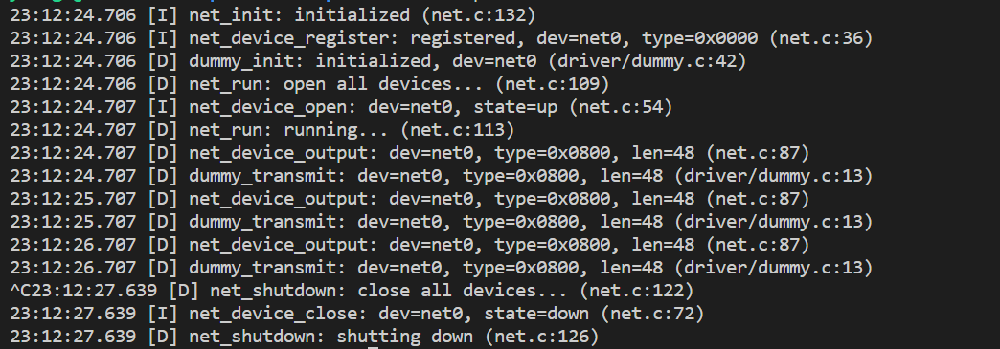

# memo  
# commitしない
## MTU(Maximum Transmission Unit)
・そのデータリンクで一度に送信可能なデータの最大サイズ  
・データリンクによってMTUの値は異なる(Ethernetの標準的なMTUは1500)  
・MTUを超えるサイズのデータは送信できない(上位のレイヤでサイズを調整する必要がある)  

## net_input_handler
デバイスが受信したパケットをプロトコルスタックに渡す関数  
・プロトコルスタックへのデータの入り口であり、デバイスドライバから呼び出されることを想定している  

## ダミーデバイスの仕様
・入力:なし(データを受信することはない)  
・出力:データを破棄  

step1の実行結果  
